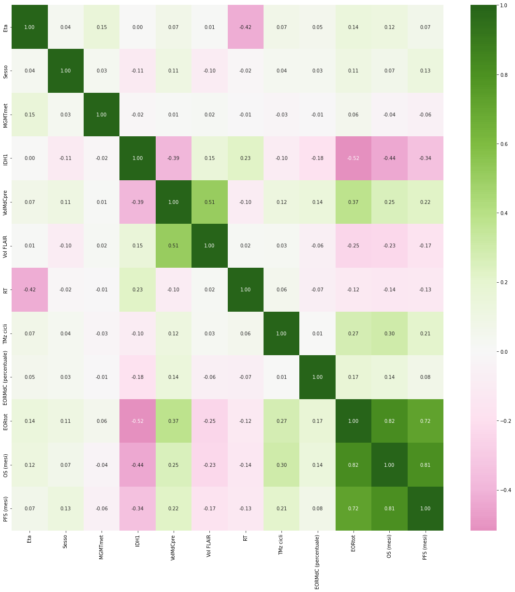
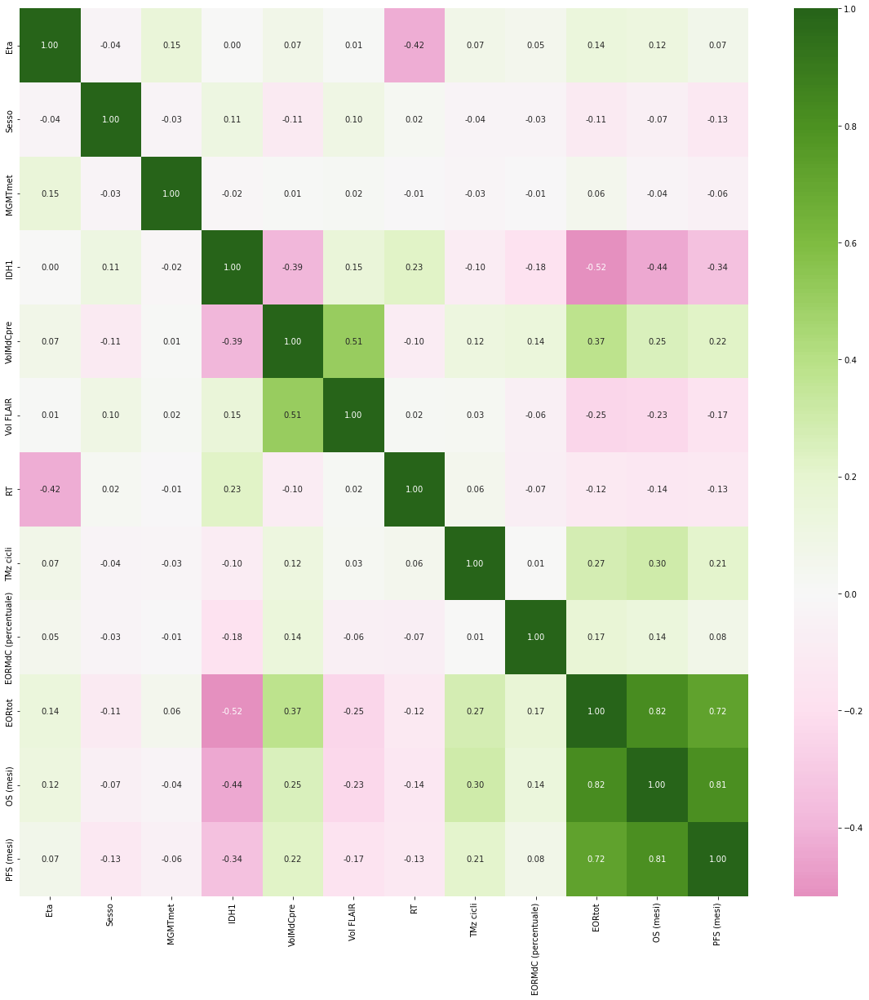

In this notebook we will preprocess the data and create a dataframe that we can use for further studies.  
We start by importing the necessary libraries.


```python
import pandas as pd
import numpy as np
import seaborn as sns
import matplotlib.pyplot as plt
```

Let's take a look at the data.


```python
# read data from xlsx file
data = pd.read_excel('data.xlsx')
data.head()
```


<div>
<style scoped>
    .dataframe tbody tr th:only-of-type {
        vertical-align: middle;
    }

    .dataframe tbody tr th {
        vertical-align: top;
    }

    .dataframe thead th {
        text-align: right;
    }
</style>
<table border="1" class="dataframe">
  <thead>
    <tr style="text-align: right;">
      <th></th>
      <th>Eta</th>
      <th>Sesso</th>
      <th>MGMTmet</th>
      <th>IDH1</th>
      <th>Unnamed: 4</th>
      <th>VolMdCpre</th>
      <th>Vol FLAIR</th>
      <th>Unnamed: 7</th>
      <th>RT</th>
      <th>TMz cicli</th>
      <th>Unnamed: 10</th>
      <th>EORMdC (percentuale)</th>
      <th>EORtot</th>
      <th>Unnamed: 13</th>
      <th>OS (mesi)</th>
      <th>PFS (mesi)</th>
    </tr>
  </thead>
  <tbody>
    <tr>
      <th>0</th>
      <td>51</td>
      <td>1</td>
      <td>0</td>
      <td>1</td>
      <td>NaN</td>
      <td>51.5</td>
      <td>172.6</td>
      <td>NaN</td>
      <td>64</td>
      <td>6</td>
      <td>NaN</td>
      <td>0.955340</td>
      <td>0.643685</td>
      <td>NaN</td>
      <td>17</td>
      <td>11</td>
    </tr>
    <tr>
      <th>1</th>
      <td>51</td>
      <td>1</td>
      <td>0</td>
      <td>1</td>
      <td>NaN</td>
      <td>48.2</td>
      <td>146.4</td>
      <td>NaN</td>
      <td>64</td>
      <td>6</td>
      <td>NaN</td>
      <td>1.000000</td>
      <td>0.890710</td>
      <td>NaN</td>
      <td>25</td>
      <td>19</td>
    </tr>
    <tr>
      <th>2</th>
      <td>55</td>
      <td>1</td>
      <td>0</td>
      <td>1</td>
      <td>NaN</td>
      <td>43.8</td>
      <td>11.2</td>
      <td>NaN</td>
      <td>64</td>
      <td>6</td>
      <td>NaN</td>
      <td>1.000000</td>
      <td>0.803571</td>
      <td>NaN</td>
      <td>23</td>
      <td>16</td>
    </tr>
    <tr>
      <th>3</th>
      <td>77</td>
      <td>1</td>
      <td>1</td>
      <td>1</td>
      <td>NaN</td>
      <td>82.2</td>
      <td>227.7</td>
      <td>NaN</td>
      <td>64</td>
      <td>6</td>
      <td>NaN</td>
      <td>0.959854</td>
      <td>0.631094</td>
      <td>NaN</td>
      <td>19</td>
      <td>9</td>
    </tr>
    <tr>
      <th>4</th>
      <td>76</td>
      <td>1</td>
      <td>0</td>
      <td>1</td>
      <td>NaN</td>
      <td>10.2</td>
      <td>26.5</td>
      <td>NaN</td>
      <td>48</td>
      <td>6</td>
      <td>NaN</td>
      <td>1.000000</td>
      <td>0.845283</td>
      <td>NaN</td>
      <td>29</td>
      <td>15</td>
    </tr>
  </tbody>
</table>
</div>


The excel file has some unnamed columns, so we will drop them.


```python
# drop Unnamed columns
data.drop(data.columns[data.columns.str.contains('unnamed',case = False)],axis = 1, inplace = True)
data.head()
```


<div>
<style scoped>
    .dataframe tbody tr th:only-of-type {
        vertical-align: middle;
    }

    .dataframe tbody tr th {
        vertical-align: top;
    }

    .dataframe thead th {
        text-align: right;
    }
</style>
<table border="1" class="dataframe">
  <thead>
    <tr style="text-align: right;">
      <th></th>
      <th>Eta</th>
      <th>Sesso</th>
      <th>MGMTmet</th>
      <th>IDH1</th>
      <th>VolMdCpre</th>
      <th>Vol FLAIR</th>
      <th>RT</th>
      <th>TMz cicli</th>
      <th>EORMdC (percentuale)</th>
      <th>EORtot</th>
      <th>OS (mesi)</th>
      <th>PFS (mesi)</th>
    </tr>
  </thead>
  <tbody>
    <tr>
      <th>0</th>
      <td>51</td>
      <td>1</td>
      <td>0</td>
      <td>1</td>
      <td>51.5</td>
      <td>172.6</td>
      <td>64</td>
      <td>6</td>
      <td>0.955340</td>
      <td>0.643685</td>
      <td>17</td>
      <td>11</td>
    </tr>
    <tr>
      <th>1</th>
      <td>51</td>
      <td>1</td>
      <td>0</td>
      <td>1</td>
      <td>48.2</td>
      <td>146.4</td>
      <td>64</td>
      <td>6</td>
      <td>1.000000</td>
      <td>0.890710</td>
      <td>25</td>
      <td>19</td>
    </tr>
    <tr>
      <th>2</th>
      <td>55</td>
      <td>1</td>
      <td>0</td>
      <td>1</td>
      <td>43.8</td>
      <td>11.2</td>
      <td>64</td>
      <td>6</td>
      <td>1.000000</td>
      <td>0.803571</td>
      <td>23</td>
      <td>16</td>
    </tr>
    <tr>
      <th>3</th>
      <td>77</td>
      <td>1</td>
      <td>1</td>
      <td>1</td>
      <td>82.2</td>
      <td>227.7</td>
      <td>64</td>
      <td>6</td>
      <td>0.959854</td>
      <td>0.631094</td>
      <td>19</td>
      <td>9</td>
    </tr>
    <tr>
      <th>4</th>
      <td>76</td>
      <td>1</td>
      <td>0</td>
      <td>1</td>
      <td>10.2</td>
      <td>26.5</td>
      <td>48</td>
      <td>6</td>
      <td>1.000000</td>
      <td>0.845283</td>
      <td>29</td>
      <td>15</td>
    </tr>
  </tbody>
</table>
</div>


We now use seaborn to plot the corrrelation matrix.


```python
# plot correlation matrix

corr = data.corr()
plt.figure(figsize=(20,20))
sns.heatmap(corr, annot=True, fmt=".2f", center=0, cmap='PiYG')
plt.show()
```


    

    


In order to more effectively apply machine learning algorithms in the future, we need to normalize a few columns.


```python
#normalize data by column
column_excluded = ['Sesso', 'MGMTmet', 'IDH1']
for column in data.columns:
    if column not in column_excluded:
        data[column] = (data[column] - data[column].mean()) / data[column].std()
data.head()

```


<div>
<style scoped>
    .dataframe tbody tr th:only-of-type {
        vertical-align: middle;
    }

    .dataframe tbody tr th {
        vertical-align: top;
    }

    .dataframe thead th {
        text-align: right;
    }
</style>
<table border="1" class="dataframe">
  <thead>
    <tr style="text-align: right;">
      <th></th>
      <th>Eta</th>
      <th>Sesso</th>
      <th>MGMTmet</th>
      <th>IDH1</th>
      <th>VolMdCpre</th>
      <th>Vol FLAIR</th>
      <th>RT</th>
      <th>TMz cicli</th>
      <th>EORMdC (percentuale)</th>
      <th>EORtot</th>
      <th>OS (mesi)</th>
      <th>PFS (mesi)</th>
    </tr>
  </thead>
  <tbody>
    <tr>
      <th>0</th>
      <td>-0.973648</td>
      <td>1</td>
      <td>0</td>
      <td>1</td>
      <td>0.427323</td>
      <td>1.831101</td>
      <td>0.321120</td>
      <td>-0.085274</td>
      <td>-0.360291</td>
      <td>-0.686745</td>
      <td>-1.042213</td>
      <td>-0.686944</td>
    </tr>
    <tr>
      <th>1</th>
      <td>-0.973648</td>
      <td>1</td>
      <td>0</td>
      <td>1</td>
      <td>0.291637</td>
      <td>1.305539</td>
      <td>0.321120</td>
      <td>-0.085274</td>
      <td>0.231308</td>
      <td>0.488303</td>
      <td>-0.312542</td>
      <td>0.343472</td>
    </tr>
    <tr>
      <th>2</th>
      <td>-0.641156</td>
      <td>1</td>
      <td>0</td>
      <td>1</td>
      <td>0.110722</td>
      <td>-1.406522</td>
      <td>0.321120</td>
      <td>-0.085274</td>
      <td>0.231308</td>
      <td>0.073801</td>
      <td>-0.494960</td>
      <td>-0.042934</td>
    </tr>
    <tr>
      <th>3</th>
      <td>1.187552</td>
      <td>1</td>
      <td>1</td>
      <td>1</td>
      <td>1.689613</td>
      <td>2.936386</td>
      <td>0.321120</td>
      <td>-0.085274</td>
      <td>-0.300493</td>
      <td>-0.746639</td>
      <td>-0.859795</td>
      <td>-0.944548</td>
    </tr>
    <tr>
      <th>4</th>
      <td>1.104429</td>
      <td>1</td>
      <td>0</td>
      <td>1</td>
      <td>-1.270807</td>
      <td>-1.099610</td>
      <td>-1.558608</td>
      <td>-0.085274</td>
      <td>0.231308</td>
      <td>0.272214</td>
      <td>0.052293</td>
      <td>-0.171736</td>
    </tr>
  </tbody>
</table>
</div>


We also remap the values in the 'Sesso' column to 1 and 0.


```python
data['Sesso'] = data['Sesso'].apply(lambda x: 1 if x == 1 else 0)
data
```


<div>
<style scoped>
    .dataframe tbody tr th:only-of-type {
        vertical-align: middle;
    }

    .dataframe tbody tr th {
        vertical-align: top;
    }

    .dataframe thead th {
        text-align: right;
    }
</style>
<table border="1" class="dataframe">
  <thead>
    <tr style="text-align: right;">
      <th></th>
      <th>Eta</th>
      <th>Sesso</th>
      <th>MGMTmet</th>
      <th>IDH1</th>
      <th>VolMdCpre</th>
      <th>Vol FLAIR</th>
      <th>RT</th>
      <th>TMz cicli</th>
      <th>EORMdC (percentuale)</th>
      <th>EORtot</th>
      <th>OS (mesi)</th>
      <th>PFS (mesi)</th>
    </tr>
  </thead>
  <tbody>
    <tr>
      <th>0</th>
      <td>-0.973648</td>
      <td>1</td>
      <td>0</td>
      <td>1</td>
      <td>0.427323</td>
      <td>1.831101</td>
      <td>0.321120</td>
      <td>-0.085274</td>
      <td>-0.360291</td>
      <td>-0.686745</td>
      <td>-1.042213</td>
      <td>-0.686944</td>
    </tr>
    <tr>
      <th>1</th>
      <td>-0.973648</td>
      <td>1</td>
      <td>0</td>
      <td>1</td>
      <td>0.291637</td>
      <td>1.305539</td>
      <td>0.321120</td>
      <td>-0.085274</td>
      <td>0.231308</td>
      <td>0.488303</td>
      <td>-0.312542</td>
      <td>0.343472</td>
    </tr>
    <tr>
      <th>2</th>
      <td>-0.641156</td>
      <td>1</td>
      <td>0</td>
      <td>1</td>
      <td>0.110722</td>
      <td>-1.406522</td>
      <td>0.321120</td>
      <td>-0.085274</td>
      <td>0.231308</td>
      <td>0.073801</td>
      <td>-0.494960</td>
      <td>-0.042934</td>
    </tr>
    <tr>
      <th>3</th>
      <td>1.187552</td>
      <td>1</td>
      <td>1</td>
      <td>1</td>
      <td>1.689613</td>
      <td>2.936386</td>
      <td>0.321120</td>
      <td>-0.085274</td>
      <td>-0.300493</td>
      <td>-0.746639</td>
      <td>-0.859795</td>
      <td>-0.944548</td>
    </tr>
    <tr>
      <th>4</th>
      <td>1.104429</td>
      <td>1</td>
      <td>0</td>
      <td>1</td>
      <td>-1.270807</td>
      <td>-1.099610</td>
      <td>-1.558608</td>
      <td>-0.085274</td>
      <td>0.231308</td>
      <td>0.272214</td>
      <td>0.052293</td>
      <td>-0.171736</td>
    </tr>
    <tr>
      <th>...</th>
      <td>...</td>
      <td>...</td>
      <td>...</td>
      <td>...</td>
      <td>...</td>
      <td>...</td>
      <td>...</td>
      <td>...</td>
      <td>...</td>
      <td>...</td>
      <td>...</td>
      <td>...</td>
    </tr>
    <tr>
      <th>145</th>
      <td>-1.223018</td>
      <td>1</td>
      <td>0</td>
      <td>0</td>
      <td>0.225850</td>
      <td>-1.077544</td>
      <td>0.321120</td>
      <td>-0.085274</td>
      <td>0.231308</td>
      <td>0.680710</td>
      <td>0.325920</td>
      <td>0.601076</td>
    </tr>
    <tr>
      <th>146</th>
      <td>-0.890525</td>
      <td>0</td>
      <td>0</td>
      <td>1</td>
      <td>0.970067</td>
      <td>-0.333332</td>
      <td>0.321120</td>
      <td>-0.085274</td>
      <td>0.231308</td>
      <td>0.111218</td>
      <td>-0.221333</td>
      <td>0.085868</td>
    </tr>
    <tr>
      <th>147</th>
      <td>-0.308664</td>
      <td>0</td>
      <td>1</td>
      <td>0</td>
      <td>-0.604713</td>
      <td>-1.095598</td>
      <td>0.321120</td>
      <td>-0.085274</td>
      <td>0.231308</td>
      <td>1.008170</td>
      <td>0.873173</td>
      <td>0.343472</td>
    </tr>
    <tr>
      <th>148</th>
      <td>0.771936</td>
      <td>1</td>
      <td>1</td>
      <td>0</td>
      <td>1.796518</td>
      <td>1.157098</td>
      <td>0.321120</td>
      <td>-0.085274</td>
      <td>0.231308</td>
      <td>-0.018474</td>
      <td>-0.403751</td>
      <td>-0.944548</td>
    </tr>
    <tr>
      <th>149</th>
      <td>-0.391787</td>
      <td>0</td>
      <td>1</td>
      <td>0</td>
      <td>-0.551260</td>
      <td>-0.515875</td>
      <td>0.321120</td>
      <td>-0.085274</td>
      <td>0.231308</td>
      <td>0.819952</td>
      <td>0.690755</td>
      <td>-0.300538</td>
    </tr>
  </tbody>
</table>
<p>150 rows × 12 columns</p>
</div>


And we plot the correlation matrix again. We notice the correlation between 'Sesso' and the last columns has of course switched sign.


```python
# plot correlation matrix
corr = data.corr()
plt.figure(figsize=(20,20))
sns.heatmap(corr, annot=True, fmt=".2f", center=0, cmap='PiYG')
plt.show()

```


    

    


```python

```
